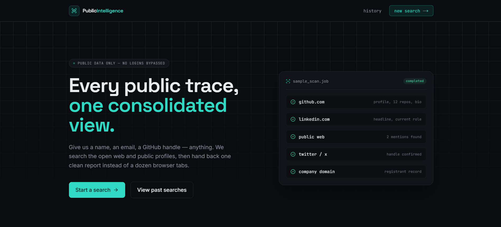
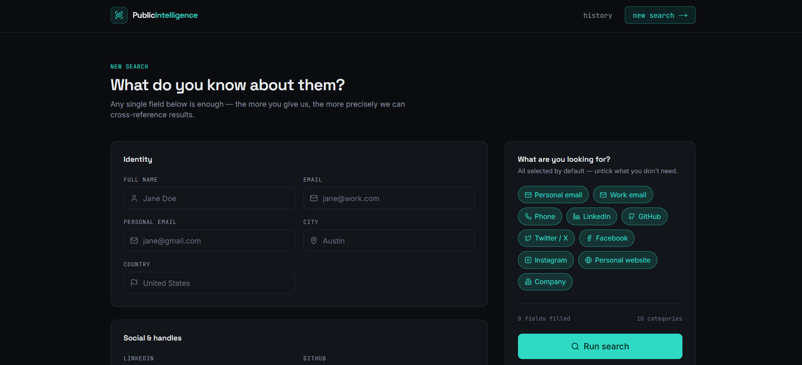
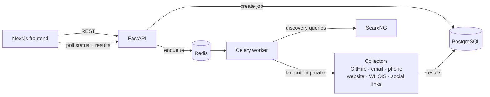

<div align="center">

# Public Intelligence

**An open-source OSINT aggregator that turns a few public clues into one source-linked report.**

[](https://github.com/akabirabbasnaqvi/osint-data-extractor/actions/workflows/ci.yml)
[](https://github.com/akabirabbasnaqvi/osint-data-extractor/actions/workflows/codeql.yml)
[](LICENSE)


[Project site](https://akabirabbasnaqvi.github.io/osint-data-extractor/) ·
[Report a bug](https://github.com/akabirabbasnaqvi/osint-data-extractor/issues/new?template=bug_report.md) ·
[Contributing](CONTRIBUTING.md) ·
[Security policy](SECURITY.md)

</div>



## Overview

Public Intelligence takes whatever you already know about a person or organisation (a name,
an email address, a GitHub handle, a company domain) and runs background collectors against
publicly available sources. Results are grouped by category, each with a **confidence
level** and a **source link**, so every finding can be checked by hand.

It uses only free, open-source tooling and needs no paid API keys.

> **Public data only.** The tool does not log in to anything, bypass access controls, or
> scrape platforms whose terms prohibit it. See [Responsible use](#responsible-use).

## Features

- **Asynchronous jobs.** Searches run in Celery workers; the UI polls and fills in results
  as collectors finish.
- **Ten result categories:** personal email, work email, phone, LinkedIn, GitHub, Twitter/X,
  Facebook, Instagram, personal website, and company (WHOIS).
- **Self-hosted discovery** through [SearxNG](https://github.com/searxng/searxng): no search
  API key, no billing account.
- **Transparent confidence scoring.** User-supplied data scores 1.0, API-verified data about
  0.9, search-engine discoveries about 0.5, and unverified guesses 0.3.
- **Per-browser search history.** Each browser sees and can delete only its own searches.
- **JSON export** of any completed search.
- **Hardened collectors.** Private-network targets are blocked, `robots.txt` is honoured,
  and responses are size-capped (see [Security](#security-design)).



## Architecture



1. The API validates the request, stores a `jobs` row, and enqueues `run_search`.
2. The worker runs **discovery** (search-engine queries) once, then fans out one Celery task
   per requested category using a chord.
3. Each collector writes its own `results` rows. A callback marks the job `completed`, or
   `failed` if a step crashes or times out.

## Tech stack

| Layer | Technology |
| --- | --- |
| Frontend | Next.js 15 (App Router), React 18, TypeScript, Tailwind CSS |
| API | FastAPI, Pydantic v2, SlowAPI rate limiting (Python 3.11) |
| Workers | Celery 5 with Redis |
| Database | PostgreSQL 16, SQLAlchemy 2, Alembic migrations |
| Collection | requests, phonenumbers, python-whois, SearxNG |
| Tooling | Docker Compose, pytest, GitHub Actions, CodeQL, Dependabot |

## Getting started

### Prerequisites

- [Docker](https://docs.docker.com/get-docker/) with Compose v2

### Run locally

```bash
git clone https://github.com/akabirabbasnaqvi/osint-data-extractor.git
cd osint-data-extractor

cp .env.example .env          # review the values; defaults work for local use
docker compose up -d --build  # Postgres, Redis, SearxNG, migrations, API, worker, frontend
```

| Service | URL |
| --- | --- |
| Web app | <http://localhost:3000> |
| API | <http://localhost:8000> |
| Interactive API docs | <http://localhost:8000/docs> |

Postgres (`5432`) and Redis (`6379`) are published on `127.0.0.1` only. SearxNG is reachable
only from other containers.

Stop everything with `docker compose down` (add `-v` to also delete the database volume).

## Using the API

```bash
curl -X POST http://localhost:8000/api/search \
  -H "Content-Type: application/json" \
  -H "X-Session-ID: my-local-session-0001" \
  -d '{
        "inputs":   { "full_name": "Example Person", "github": "example" },
        "retrieve": ["github", "personal_website"]
      }'
# -> {"job_id": "…", "status": "pending"}

curl http://localhost:8000/api/results/<job_id>   -H "X-Session-ID: my-local-session-0001"   # same id that created the job
```

| Method | Endpoint | Description | Rate limit |
| --- | --- | --- | --- |
| `POST` | `/api/search` | Create a search job (returns `201`) | 10 / min |
| `GET` | `/api/results/{job_id}` | Job status, progress, and results grouped by category (best match first). Needs the `X-Session-ID` that created the job | 60 / min |
| `GET` | `/api/jobs` | The caller's 50 most recent searches (needs `X-Session-ID`) | 60 / min |
| `DELETE` | `/api/jobs/{job_id}` | Delete one of the caller's jobs and its results | 20 / min |
| `GET` | `/api/health` | Liveness check | — |
| `GET` | `/api/health/ready` | Readiness check: `503` if the database is unreachable | — |

Poll `GET /api/results/{job_id}` until `status` is `completed` or `failed`.

**Inputs.** At least one field is required. Accepted fields: `full_name`, `email`,
`personal_email`, `city`, `country`, `linkedin`, `github`, `twitter`, `facebook`,
`instagram`, `company_name`, `company_website`. Values are trimmed and limited to 200
characters. Bare domains (`acme.com`) and handles (`@janedoe`) are accepted; URLs pointing
at localhost or private networks are rejected. Social handles may contain only letters,
digits, `.`, `_` and `-`. `country` is only used as a phone-number region hint, so give a
2-letter ISO code such as `US`.

**Categories (`retrieve`).** `personal_email`, `work_email`, `phone`, `linkedin`, `github`,
`twitter`, `facebook`, `instagram`, `personal_website`, `company`.

**Sessions.** The web app generates an anonymous id and sends it as `X-Session-ID`
(8–64 characters: letters, digits, `-`, `_`). Without it, `/api/jobs` returns an empty list,
and a job created with a session id can only be read or deleted with that same id (anyone
else gets `404`). This is a privacy boundary between browsers, **not** authentication.

## Configuration

Copy `.env.example` to `.env`. Never commit the real file.

| Variable | Required | Purpose |
| --- | --- | --- |
| `DATABASE_URL` | yes | PostgreSQL connection string for the API and worker |
| `REDIS_URL` | yes | Redis connection |
| `CELERY_BROKER_URL` | yes | Celery broker (Redis) |
| `CELERY_RESULT_BACKEND` | yes | Celery result backend (Redis) |
| `SECRET_KEY` | yes | Application secret; use a long random value outside development |
| `ALLOWED_ORIGINS` | no | Comma-separated frontend origins allowed by CORS (default `http://localhost:3000`) |
| `STALE_JOB_MINUTES` | no | A job still pending/running after this long is reported as failed (default `30`) |
| `RATE_LIMIT_STORAGE` | no | Where rate-limit counters live (default `memory://`; use Redis, e.g. `redis://redis:6379/2`, with several API workers) |
| `SEARXNG_SECRET` | production | Secret for the SearxNG container; `docker-compose.prod.yml` refuses to start without it |
| `SEARXNG_URL` | no | Internal SearxNG URL (default `http://searxng:8080`) |
| `HUNTER_IO_API_KEY` | no | Enables Hunter.io email lookups for work-email searches |
| `HTTP_PROXY` | no | Reserved for an outbound proxy; not yet applied by the collectors |
| `NEXT_PUBLIC_API_URL` | frontend | API base URL baked into the frontend build (production) |

## How collection works

| Category | Behaviour |
| --- | --- |
| GitHub | Public GitHub REST API (unauthenticated). Username comes from the input or a discovered profile URL. |
| Work email | The address you supplied, an optional Hunter.io hit, and **unverified** pattern guesses (confidence 0.3). No SMTP probing is performed. |
| Personal email | The address you supplied, plus addresses found on discovered public pages. |
| Phone | Numbers found on discovered pages, validated with `phonenumbers`. |
| Personal website | Discovered pages that are not a known social platform. |
| Company | WHOIS registration facts for the company domain. Privacy-protected domains often return little. |
| LinkedIn, Facebook, Instagram, Twitter/X | **Link surfacing only.** Returns the URL you supplied or one a search engine already indexed. These sites are never visited or scraped. |

**Discovery is best-effort.** SearxNG queries Google, Bing, and other engines that rate-limit
automated traffic, so discovery can return partial or empty results. This is a limit of free
search, not a bug. GitHub lookups and anything you enter directly work regardless.

## Security design

- **SSRF protection.** Collectors fetch only `http(s)` URLs whose host resolves to public IP
  addresses. Every redirect hop is re-checked, so a page cannot bounce a worker to Redis,
  Postgres, or a cloud metadata endpoint.
- **Polite fetching.** `robots.txt` is fetched with a timeout and honoured, user agents are
  rotated, and response bodies are capped at 2 MB.
- **Input validation.** Strict Pydantic models, length limits, and private-network URL
  rejection on submitted fields.
- **Session-scoped data.** Job listing, results and deletion only expose the caller's own
  searches.
- **Safe links.** Third-party URLs are limited to `http(s)` and are checked again before the
  UI renders them as links.
- **Rate limiting** on every data endpoint, a restricted CORS policy, and task time limits so a
  stuck collector cannot hold a worker or leave a job "running" forever. Jobs whose worker
  died are reported as failed after `STALE_JOB_MINUTES`.
- **Least exposure.** Production images run as a non-root user; development Postgres and
  Redis bind to localhost.

Known limit: DNS answers are checked before each request, so a DNS-rebinding attack remains
theoretically possible. For hardened deployments, add network-level egress rules as well.

See [`SECURITY.md`](SECURITY.md) for supported versions and how to report a vulnerability.

## Development

```bash
# Backend tests (no running services needed)
cd backend
python -m venv .venv && source .venv/bin/activate      # Windows: .venv\Scripts\activate
pip install -r requirements.txt
pytest

# Frontend
cd frontend
npm ci
npm run dev          # http://localhost:3000 (set NEXT_PUBLIC_API_URL if the API is elsewhere)
npm run typecheck   # type-check
npm run build        # production build
```

Database changes use Alembic: `docker compose run --rm migrate alembic upgrade head`
applies migrations; new revisions live in `backend/alembic/versions/`.

GitHub Actions runs the backend tests, the frontend type-check and production build, and a
Docker Compose config check (development and production files) on every push and pull
request to `main`. CodeQL and Dependabot are enabled.

## Project structure

```
.
├── backend/
│   ├── main.py                 # FastAPI app, CORS, rate limiting
│   ├── config.py               # Environment settings (pydantic-settings)
│   ├── session.py              # X-Session-ID dependency
│   ├── routers/                # /api/search, /api/results, /api/jobs
│   ├── schemas/                # Request validation and response models
│   ├── models/                 # SQLAlchemy models (jobs, results)
│   ├── alembic/                # Database migrations
│   ├── tasks/
│   │   ├── orchestrator.py     # Discovery → parallel fan-out → completion/failure
│   │   └── scrapers/           # GitHub, email, phone, website, company, social links
│   └── tests/                  # pytest suite
├── frontend/
│   ├── app/                    # Pages: landing, search, results/[jobId], history
│   ├── components/             # SearchForm, ResultCard, StatusBadge, Nav
│   └── lib/                    # API client, shared types, field definitions
├── searxng/settings.yml        # Self-hosted discovery engine config
├── docs/                       # GitHub Pages project site and screenshots
├── docker-compose.yml          # Local development stack
├── docker-compose.prod.yml     # Production-oriented stack
└── Public Intelligence SaaS_blueprint.pdf   # Original project blueprint
```

## Deployment

`docker-compose.yml` is for local development only. For a production-style deployment:

```bash
cp .env.production.example .env.production   # replace every placeholder
docker compose -f docker-compose.prod.yml --env-file .env.production up -d --build
```

Before exposing it to the internet, put it behind HTTPS and add **real authentication**: the
per-browser session id is not an access control. Also set `SEARXNG_SECRET` and
`RATE_LIMIT_STORAGE` (Redis) in `.env.production`, enable backups and monitoring, and define
a data-retention and deletion policy. The API, Postgres, Redis, and SearxNG should not be publicly reachable
unless each is explicitly protected.

## Responsible use

Use this project only for lawful, authorised research involving publicly available
information. Do not use it to bypass access controls, harass or stalk individuals, collect
sensitive personal data, or violate a site's terms of service, robots policy, or applicable
privacy law (including GDPR and CCPA where they apply). You are responsible for how you use
the results.

## Roadmap

- [x] Docker-based local environment with automatic migrations
- [x] Asynchronous search jobs, results page, and per-browser history
- [x] CI, dependency monitoring, and static security analysis
- [x] SSRF-hardened collectors, task time limits, and failure handling
- [ ] Authenticated users and role-based access control
- [ ] Automatic data-retention and deletion controls
- [ ] Job progress reporting (currently jumps from 0 to 100)
- [ ] Production monitoring, backups, and deployment guide
- [ ] Integration tests against a real Postgres/Redis stack

## Contributing

Contributions are welcome. Please read [`CONTRIBUTING.md`](CONTRIBUTING.md) first; collectors
must never bypass authentication, CAPTCHAs, paywalls, or other access controls.

## License

Released under the [MIT License](LICENSE).
